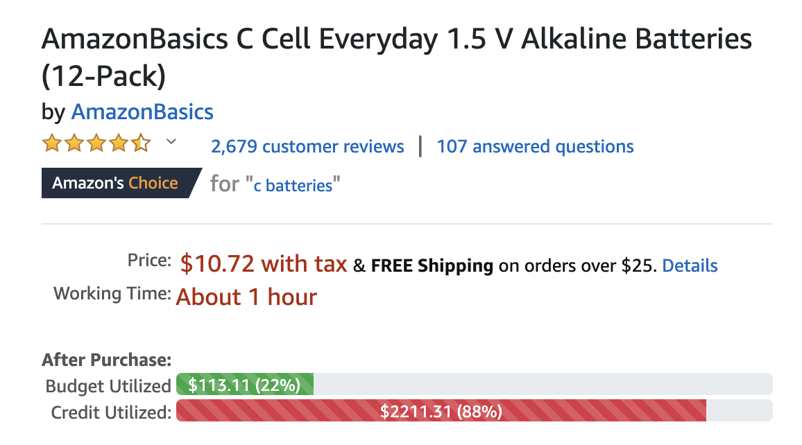
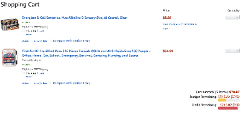
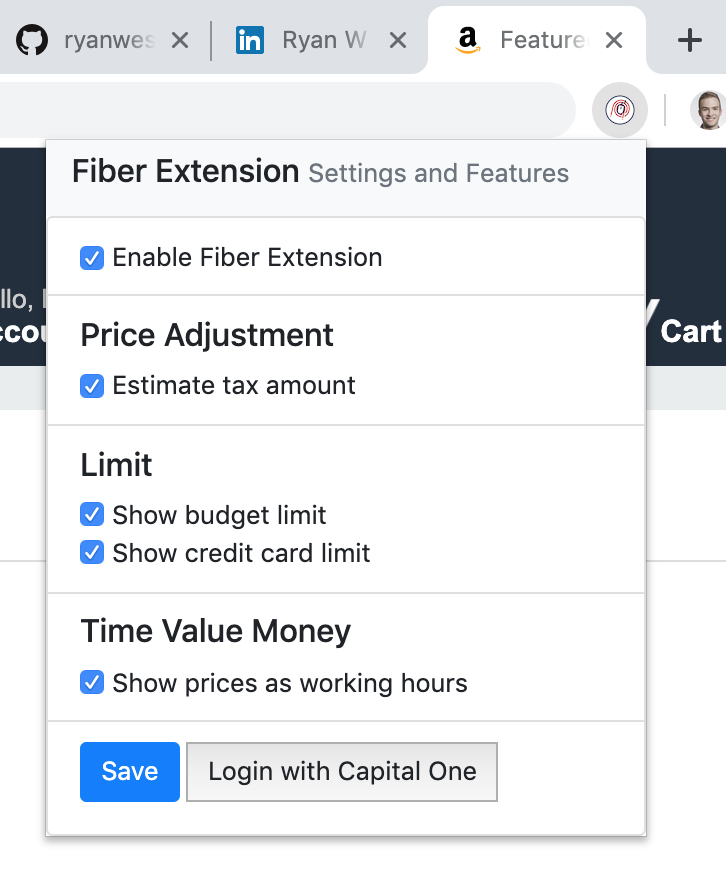

# Amazon Budgeting Chrome Extension (aka Fiber)

The Fiber Chrome Extension was our entry for the 2019 Intern Onboarding Hackathon at Capital One. After two rounds of judging projects by 540 software engineering interns, this extension won first place. Our team consisted of four other Capital One software engineering interns and I.

It is common for individuals to make a personal budget to ensure they can pay their bills every month and still have spending money. However, it is difficult to constantly check and remember the various budget categories set, and many people quickly give up or forget. This chrome extension is meant to help with this situation and improve Amazon shoppers' financial literacy by integrating their budget & credit card data directly into the Amazon's site. The data is easy to understand provides warnings and recommendations to users.

This repository is hosted with permission by Capital One and contains no confidential data.

## Features

- Replaces price with one with local state taxes added
- Displays the amount of time needed to work to buy the product
- Displays a horizontal loading-bar of the user's total budget and the remaining budget they would have after purchasing the product
- Displays a horizontal loading-bar of the user's total credit limit and how much limit would be left after purchasing the product
- When in the Amazon Shopping Cart page, displays these horizontal bars as well
- Features a settings panel which can enable/disable parts of the extension and has a mock login for Capital One

## Future Work

We only had 24 hours to come up with our idea, plan, code, and prepare our presentations. If we were to continue developing this extension, we would consider adding the following features:
- Adding support for additional websites such as Walmart and eBay
- Adding support for generic websites (i.e., attempting to identify shopping webpages based on html content and adding budget information as necessary)
- Category-based budgeting
- Adding APIs for Capital One, Intuit's Mint, and other companies which manage user's financial data so they can be displayed
- General bugfixing of the extension within Amazon
